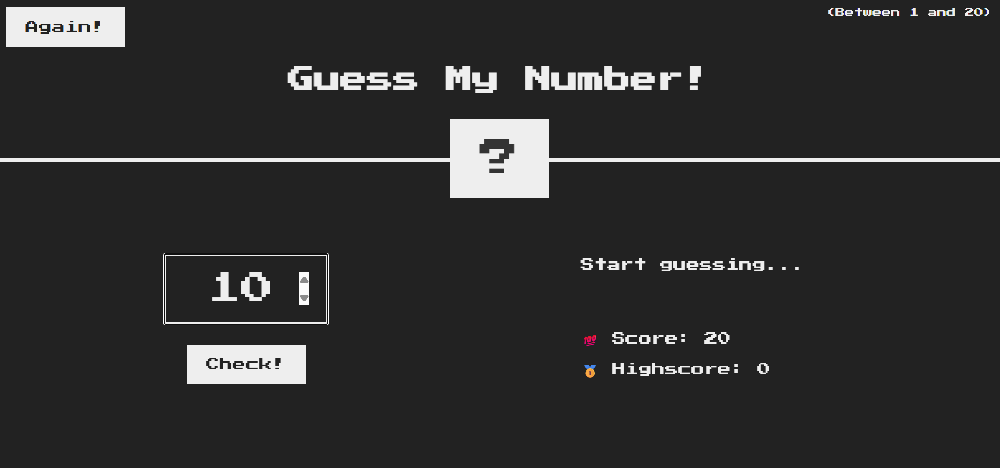
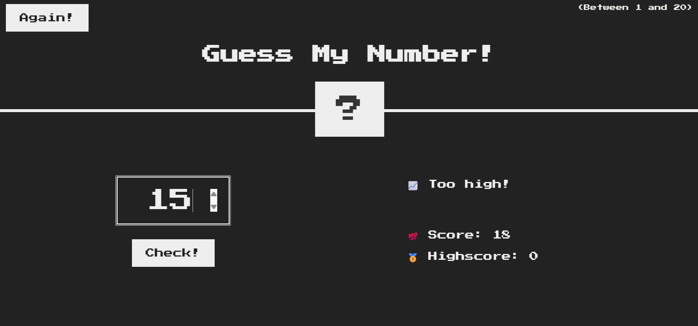
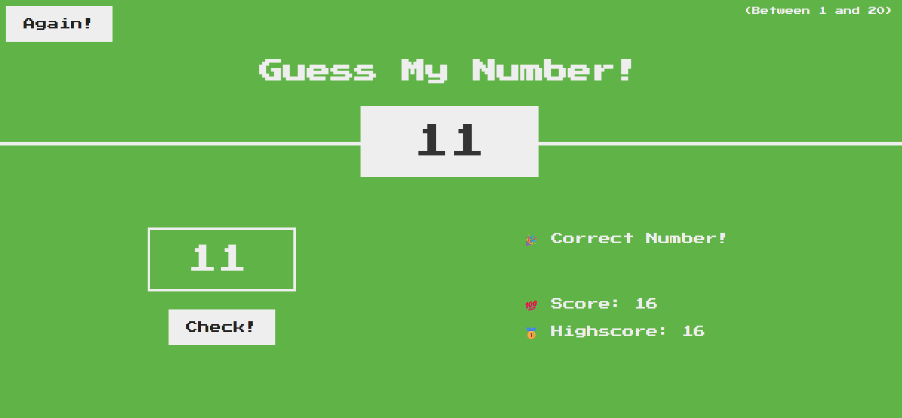
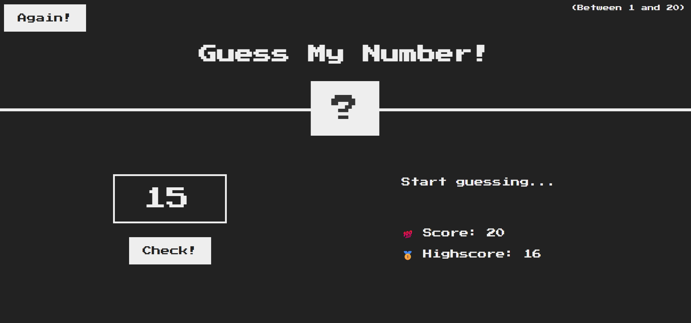

# 🎯 Guess My Number - JavaScript Game

A simple interactive game where the player tries to guess a random number between 1 and 20. Built with **HTML**, **CSS**, and **JavaScript**.

---

## 🕹️ How to Play

- Click **"Check!"** after entering a number.
- Get feedback: Too high, too low, or correct!
- Score starts at 20 and decreases with each wrong guess.
- Click **"Again!"** to reset and play again.

---

## 📸 Screenshot

### 🎮 Game UI

### ❌ Wrong Guess - Too Low

### ❌ Wrong Guess - Too High

### ✅ Correct Guess

### 🔁 Restarting the Game

---

## 🚀 Features

- Random number generation using `Math.random()`
- Score and highscore tracking
- Dynamic DOM manipulation
- Responsive UI styling with CSS
- Game reset functionality

---

## 🛠️ Tech Stack

- HTML5
- CSS3
- JavaScript (DOM Manipulation)

---

## 📂 Project Structure
- Guess-My-Number
  1. index.html # Main HTML file
  2. style.css # Styling (CSS)
  3. script.js # Game logic (JavaScript)
  4. prettierrc # Code formatting config

---

## 💡 Learnings

- Practiced using event listeners and `addEventListener`
- Improved DOM selection and manipulation skills
- Learned about updating CSS dynamically using JavaScript

---

## 🧠 Future Improvements

- Add difficulty levels (Easy, Medium, Hard)
- Add sound effects
- Track number of attempts
- Mobile optimization

---

## 🙋‍♀️ Author

**Aakansha Aghav**

Feel free to ⭐ the repo if you liked the project!

